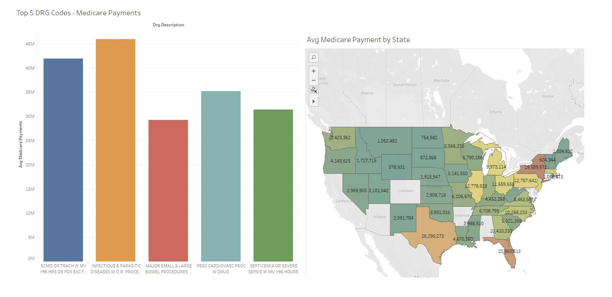

# Statistical Analysis of Medicare Payments
## Overview
Medicare Payments data is mergied with the Inpatient Prospect Payment System (IPPS) and the Total Performance Score(TPS) of the hospitals. Clinical Outcomes Score, Efficiency and Cost Reduction Score, Safety Score, Community and Engagement Score, these four types of hospital scores are considered to get the results. With the introduction of the Inpatient Prospective Payment System (IPPS), it is assumed that all DRGs are paid out uniformly to the various hospitals with an adjustment for location and prevailing wage index. However, Medicare costs have been rising year on year. While this increase is in part due to the increasing costs of drugs and its monopolization by pharma cos, hospitals are also constantly investing money in improving their facilities. With the hospitals seeking to make a profit on their investments, the concern over hospital overbilling Medicare arises.

#### analysis aims to answer the following questions,
- How do out-of-pocket charges vary across the United State for each Diagnosis Related Group (DRG)?
- How do extra charges (service charges) vary across different medical facilities in the state of Florida?
- Are medical providers paid the same across the United States by Medicare for each Diagnosis Related Group (DRG)?

## Data Source and Exploration 
Our primary data source for the analysis was the Data portal on the Centers for Medicare & Medicaid Services’ website. The Inpatient Prospective Payment System data file for 2017 provides a provider-level summary for the top 100 Diagnosis Related Groups. Each record represents an aggregated measure of medicare payments, provider billing and total covered charges for every combination of DRG & hospitals participating in the program.

In order to control for the impact of the hospital’s performance measures on the medicare payouts, we integrated the Hospital Value Based Purchasing System (HVBPS) data. Each record represents a participating medical provider’s score summary across the four domains - safety, community & engagement, clinical outcomes and efficiency.

Finally, we used the Census Bureau's 2017 estimates for population across the various counties, cities and states and prevailing wage estimates to control for the differences in population and cost of living during our analysis.

## Exploratory Data Analysis

## Data Pre-Processing and Feature Engineering
#### Data Merging
We merged IPPS, HVP performance, Average Income and Average Population dataset by performing an inner join on facility ID and state.

#### Data Transformation
- Converted column names to lowercase and renamed variables to achieve consistency. Splitted DRG definition into DRG code and DRG description.
- Verified if any features have missing values.
- Replaced missing values from performance variables with ‘Not Available’
- Converted continuous variables to numeric and categorical variables into factors.
- Scaled predictors for standardization and rounded fraction up to 4 decimal places.
- Performed Log Transformation for variables with right skewed distribution.

#### Feature Engineering
Created three different features of Average Out Of Pocket Payment, Average Extra Payment and Percentage Payment Reduction.

## Results/Answers of Analysis aims
- How do out-of-pocket charges vary across the United State for each Diagnosis Related Group (DRG)?

- How do extra charges (service charges) vary across different medical facilities in the state of Florida?

- Are medical providers paid the same across the United States by Medicare for each Diagnosis Related Group (DRG)?

## Recommendations & Future Scope
- Hospitals in the states of Hawaii, Utah, and Virginia should probe into their billing as they seem to have the highest out of pocket expenses, which has a higher chance of not being repaid since it is paid off by the patients.
- Medicare should probe into hospitals such as the Memorial Regional Hospital, Viera Hospital and Coral Gables Hospitals as they are among the highest in terms of extra charges billed to patients resulting in expensive medical treatment bills for the DRG’s as compared to other facilities.
- State of Hawaii has the maximum medicare payment considering other states having similar average household income and population.
- State of Virginia has the minimum medicare payment considering other states having similar average household income and population.
- Hospitals should focus on improving their Total Performance Score in order to minimize losses in terms of payment cuts from Medicare. Out of the 2500 unique medical facilities in our dataset, only 105 providers had a TPS >= 59 (the threshold beyond which payment reductions kick in).
